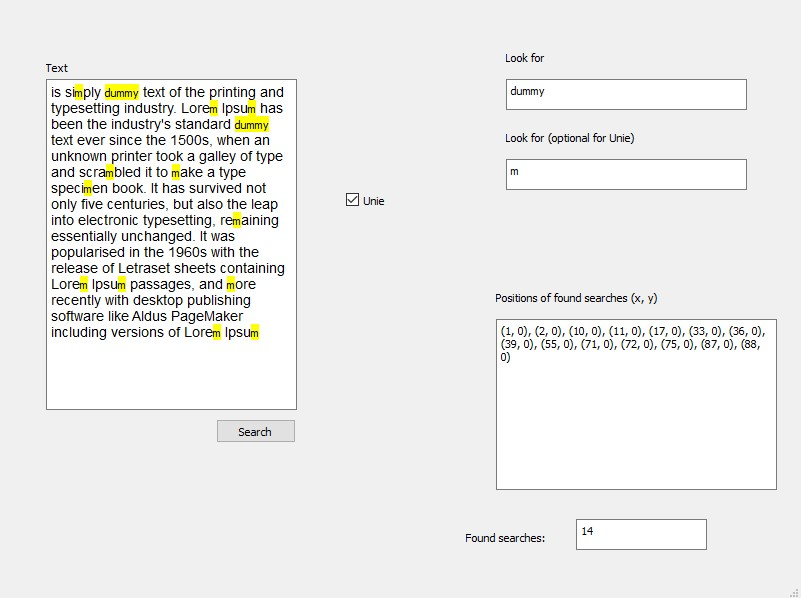

# Pattern-Searching

This projects is a Pattern Search that uses MSSC, TFA, REGEX->E-NFA, PRODUCT AUTOMAAT, STATE ELIMINATION algorithm for project purpose.
This project is build using cmake.
To use correctly the software copy paste text that u want to search in in "text" label and the pattern that u want to search in "look for" (it can also be a regex! ex. a + b).
There is second label for union to use this option u need to check the checkbox union and provide second argument in the second label.
This software is built using QT framework and tested using gtest framework and it works in c++14.

Thanks to: Aaditya, Marceli, Elias, Yassine
